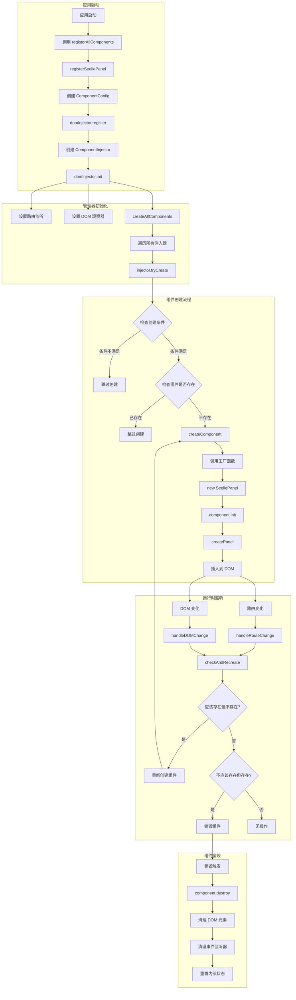
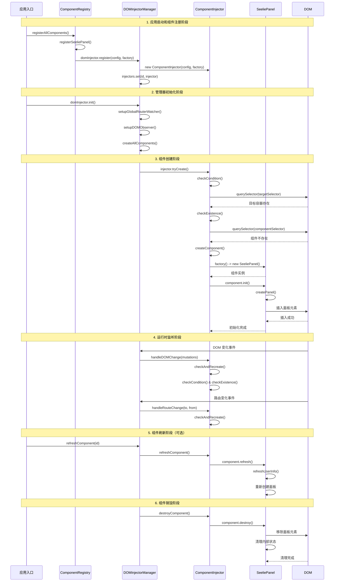
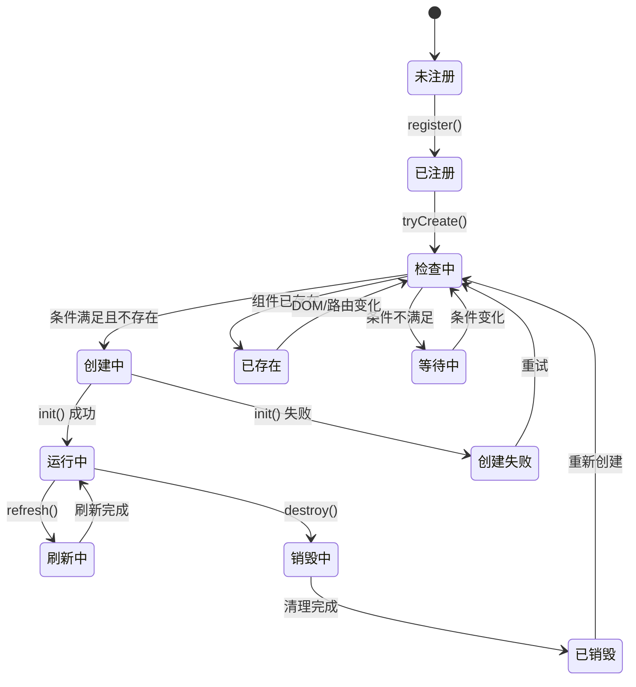

# 组件生命周期流程图

## 整体架构调用关系



## 详细生命周期时序图



## 关键调用路径说明

### 1. 启动流程

```
应用启动
  → registerAllComponents()
  → registerSeeliePanel()
  → domInjector.register(config, factory)
  → domInjector.init()
  → 设置监听器 + 创建所有组件
```

### 2. 组件创建流程

```
injector.tryCreate()
  → checkCondition() (检查目标容器、自定义条件、路由匹配)
  → checkExistence() (检查组件是否已在 DOM 中)
  → createComponent()
  → factory() (创建 SeeliePanel 实例)
  → component.init()
  → createPanel() (创建并插入 DOM 元素)
```

### 3. 运行时监听流程

```
DOM/路由变化
  → Manager 接收事件
  → 通知所有 Injector
  → checkAndRecreate()
  → 根据条件决定创建/销毁/无操作
```

### 4. 组件销毁流程

```
销毁触发
  → component.destroy()
  → 移除 DOM 元素
  → 清理事件监听器
  → 重置内部状态
```

## 状态转换图



## 核心设计特点

1. **分层架构**：Registry → Manager → Injector → Component
2. **事件驱动**：通过路由变化和 DOM 变化驱动组件生命周期
3. **条件检查**：多层条件检查确保组件在合适时机创建
4. **防重复机制**：通过状态标记防止重复创建
5. **异步支持**：全流程支持异步操作
6. **错误处理**：每个环节都有错误处理和日志记录
