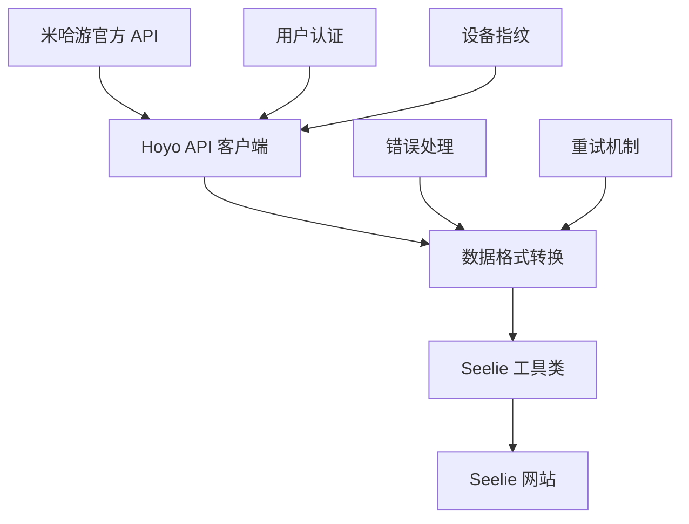

# 绝区零数据同步系统总览

## 🎯 系统概述

绝区零数据同步系统是一个完整的解决方案，用于从米哈游官方 API 获取绝区零游戏数据，并自动同步到 Seelie 网站。系统采用模块化设计，提供了完整的类型安全和错误处理。

## 🏗️ 系统架构

```
绝区零数据同步系统
├── Hoyo API 客户端          # 米哈游官方 API 接口
│   ├── 用户认证管理
│   ├── 设备指纹管理
│   ├── 角色数据获取
│   └── 游戏便笺获取
├── Seelie 工具类           # Seelie 网站数据操作
│   ├── Vue 组件访问
│   ├── 角色数据设置
│   ├── 天赋数据设置
│   └── 武器数据设置
└── 集成层                  # 数据转换和同步逻辑
    ├── 数据格式转换
    ├── 批量同步处理
    ├── 错误处理重试
    └── 自动同步管理
```

## 🚀 核心功能

### 1. 数据获取 (Hoyo API)

- **角色数据**: 获取角色等级、命座、技能等信息
- **武器数据**: 获取武器等级、精炼等信息
- **体力数据**: 获取当前体力值和恢复时间
- **设备管理**: 自动管理设备指纹和用户认证

### 2. 数据同步 (Seelie 工具类)

- **角色同步**: 设置角色等级、突破等级等
- **天赋同步**: 设置技能等级（考虑命座加成）
- **武器同步**: 设置武器等级、突破等级等
- **体力同步**: 设置当前体力值和恢复时间

### 3. 智能同步 (集成层)

- **完整同步**: 一键同步所有角色和体力数据
- **增量同步**: 只同步有变化的数据
- **选择性同步**: 根据条件过滤同步内容
- **自动同步**: 定时自动执行同步任务

## 📊 数据流程



## 🛠️ 技术特性

### 类型安全

- 完整的 TypeScript 类型定义
- 严格的类型检查和 IDE 支持
- 接口定义清晰，便于维护

### 错误处理

- 完善的错误捕获和处理
- 自动重试机制
- 用户友好的错误提示

### 性能优化

- 批量 API 请求减少网络开销
- 智能缓存避免重复请求
- 增量同步减少不必要的操作

### 调试支持

- 详细的日志输出
- 全局调试函数
- 性能监控工具

## 📋 使用场景

### 1. 日常数据同步

```typescript
// 一键同步所有数据
await fullSync();
```

### 2. 选择性同步

```typescript
// 只同步指定角色
await selectiveSync({
  characterIds: [1011, 1021],
  minLevel: 50,
});
```

### 3. 自动化同步

```typescript
// 启动自动同步（每30分钟）
autoSyncManager.start(30, { incremental: true });
```

### 4. 调试和监控

```typescript
// 检查系统状态
await DebugUtils.checkSystemStatus();

// 性能测试
await DebugUtils.performanceTest();
```

## 🔧 快速开始

### 1. 基础设置

```typescript
import { fullSync, setToast } from "@/utils/seelie";
import { ensureUserInfo } from "@/api/hoyo";

// 确保用户已登录
await ensureUserInfo();
```

### 2. 执行同步

```typescript
try {
  const result = await fullSync();
  console.log(`同步完成: ${result.characters.success} 个角色`);
} catch (error) {
  console.error("同步失败:", error);
}
```

### 3. 查看结果

同步完成后，可以在 Seelie 网站上看到更新的角色数据和体力信息。

## 📚 文档导航

### 新手入门

1. [系统总览](./overview.md) ← 当前文档
2. [集成使用指南](./integration-guide.md) - 完整的使用教程
3. [项目概述](./README.md) - 项目基础信息

### API 参考

1. [Seelie API 文档](./seelie-api-v2.md) - Seelie 工具类 API
2. [Hoyo API 文档](./hoyo-api-v2.md) - 米哈游 API 客户端
3. [API 参考手册](./API.md) - 底层 API 文档

### 开发文档

1. [开发指南](./DEVELOPMENT.md) - 开发环境和最佳实践
2. [Seelie 重构文档](./seelie-refactor.md) - 重构过程和设计
3. [API 分析文档](./ZZZ_API_Analysis.md) - API 逆向分析

## 🎯 最佳实践

### 1. 错误处理

- 始终使用 try-catch 包装异步操作
- 提供有意义的错误消息
- 实现重试机制处理网络问题

### 2. 性能优化

- 使用批量 API 而不是单个请求
- 实现增量同步减少数据传输
- 合理设置自动同步间隔

### 3. 用户体验

- 提供清晰的进度反馈
- 使用 Toast 消息通知操作结果
- 在长时间操作时显示进度

### 4. 调试和监控

- 使用调试工具检查系统状态
- 监控 API 请求性能
- 记录详细的操作日志

## 🔍 故障排除

### 常见问题

1. **设备指纹问题**

   - 现象：API 请求返回设备指纹错误
   - 解决：调用 `refreshDeviceFingerprint()`

2. **用户信息过期**

   - 现象：返回未登录错误
   - 解决：重新登录米游社或清除用户信息缓存

3. **角色数据不匹配**

   - 现象：角色无法找到或数据错误
   - 解决：检查角色 ID 映射，更新常量数据

4. **网络连接问题**
   - 现象：请求超时或连接失败
   - 解决：检查网络连接，使用重试机制

### 调试命令

在浏览器控制台中使用以下命令进行调试：

```javascript
// 检查系统状态
await DebugUtils.checkSystemStatus();

// 测试 API 连接
await DebugUtils.testApiConnection();

// 性能测试
await DebugUtils.performanceTest();

// 手动同步
await fullSync();

// 清理和重置
clearDeviceInfo();
clearUserInfo();
```

## 🚀 未来规划

### 短期目标

- [ ] 添加更多游戏数据支持（装备、材料等）
- [ ] 优化同步性能和用户体验
- [ ] 增加更多自定义同步选项

### 长期目标

- [ ] 支持其他米哈游游戏
- [ ] 提供图形化配置界面
- [ ] 实现云端数据备份和同步

---

**版本**: v2.0.0  
**最后更新**: 2025 年 1 月  
**适用游戏**: 绝区零 (Zenless Zone Zero)  
**目标网站**: https://zzz.seelie.me/
